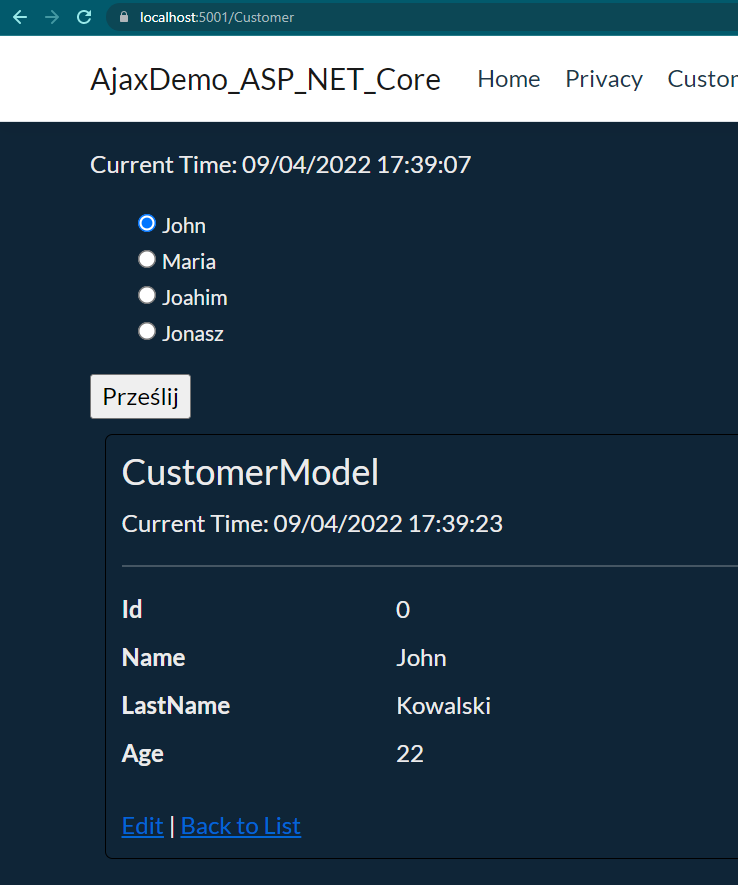

# ASP .NET CORE APP with ajax and JS 
Simple web application which does not update the entire page when you choose different option on a form.
Application includes Ajax partial page update i javascript file.
## Form

As you can see, the refresh of entire page is 17:37:07 and form partial update is dated in 17:39:23.
# App run:
There are two ways to launch an app:
<li> Launch in Visual Studio
<li>Install .Net Core 5.0 or higher release and then in application folder in terminal and type

>dotnet run

in terminal you will get an url to access your application