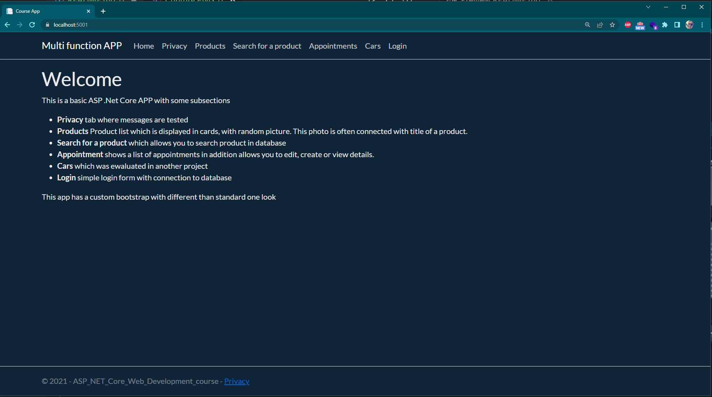
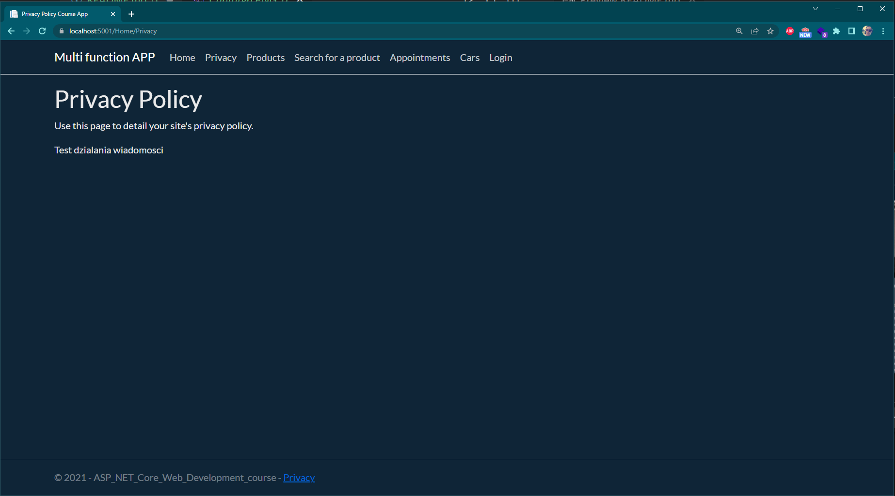
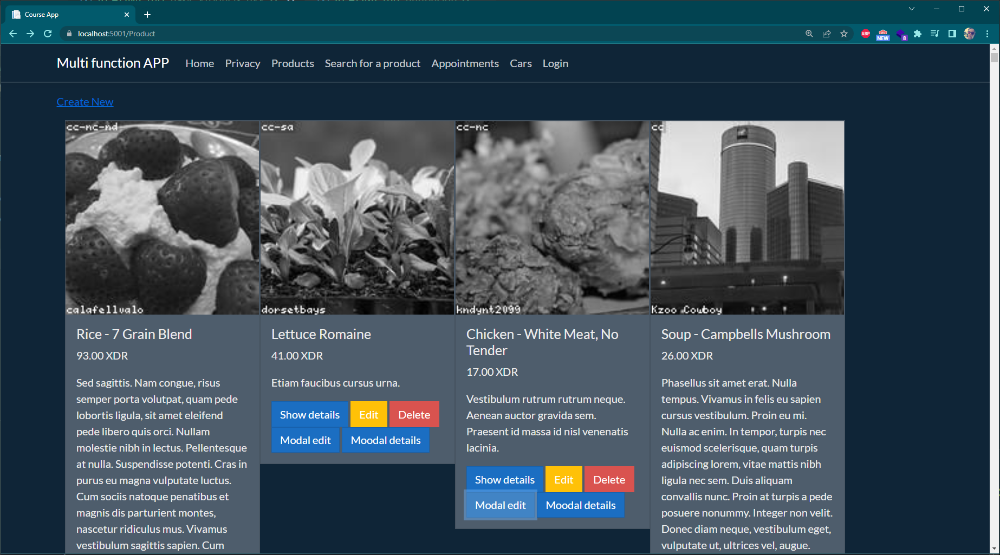
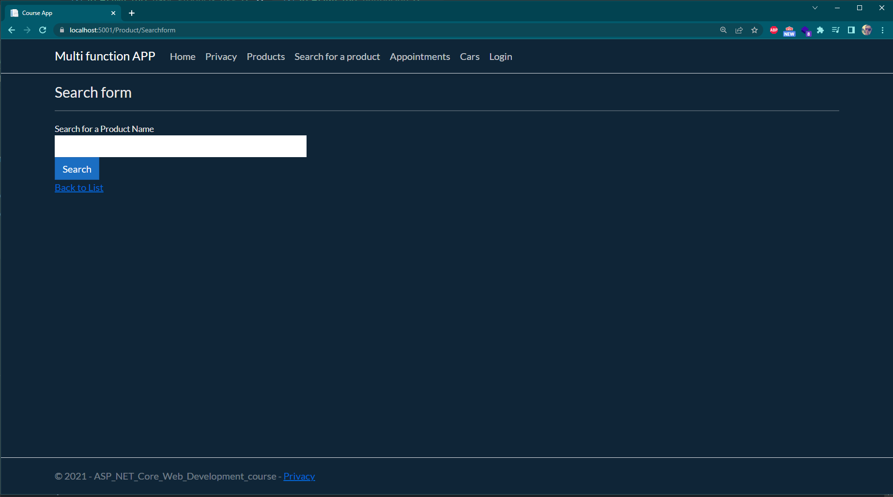
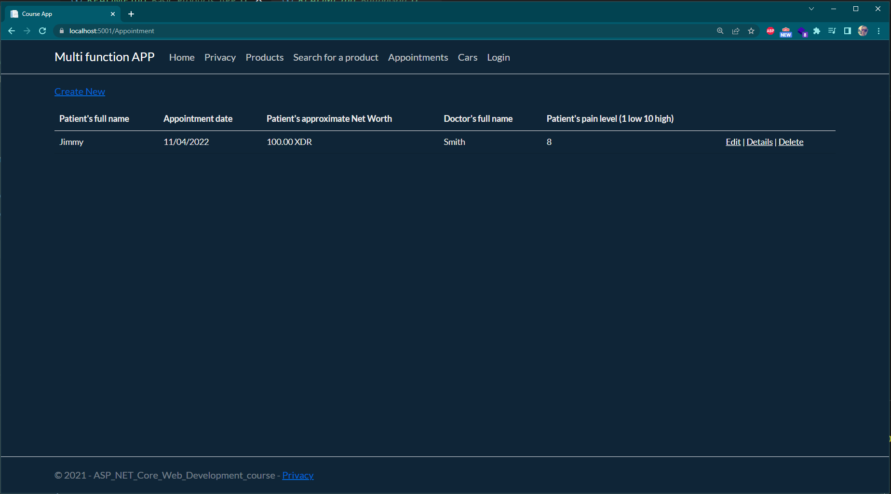
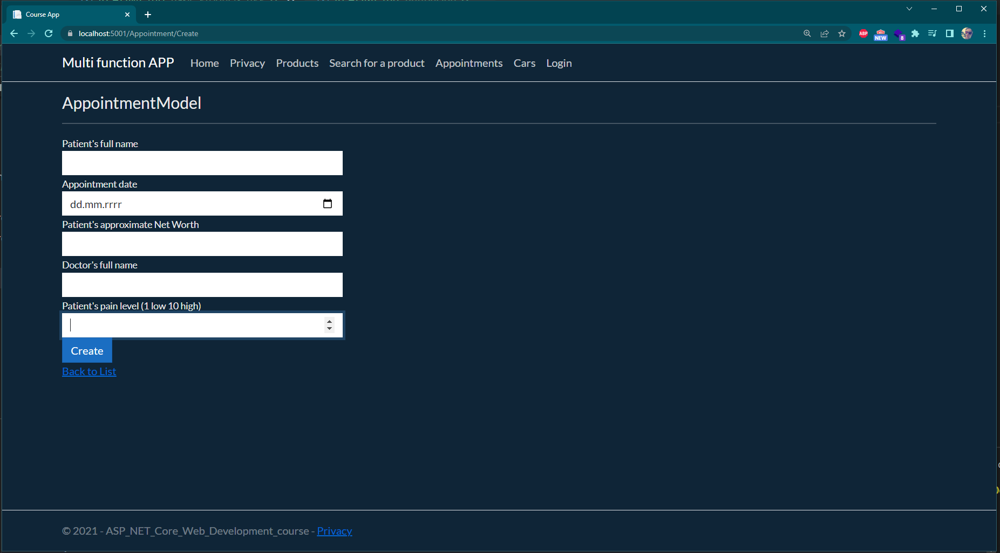
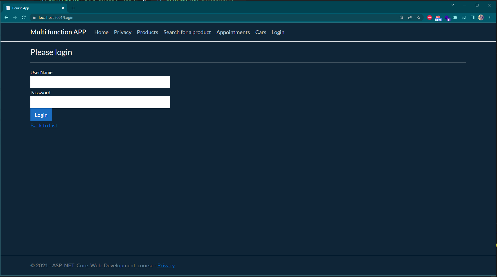
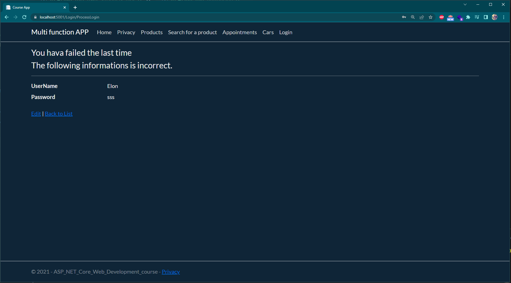

# Basic Product APP
Simple CRUD web application with auto generated products and downloaded graphics based on its name. Data are stored on SQL Sever. 
## APP map:
<li>Privacy -test of messages from ViewBag
<li>Products - Product list which is displayed in cards, with a random picture. This photo is often connected with title of a product.
<li>Search for a product which allows you to search product in database
<li>Appointment shows a list of appointments in addition allows you to edit, create or view details.
<li>Cars which was ewaluated in another project
<li>Login simple login form with connection to database

## App pages
### welcome screen

### Privacy

### Products

### Search form

### Appointments list

### Form to create a new appoinment
You cannot insert different data than expected one because of check in a appointment model

### Simple login form
When you enter correct data you get success login page otherwise fail

### Simple login form - Fail

# App run:
There are two ways to launch an app:
<li> Launch in Visual Studio
<li>Install .Net Core 5.0 or higher release and then in application folder in terminal and type

>dotnet run

in terminal you will get an url to access your application