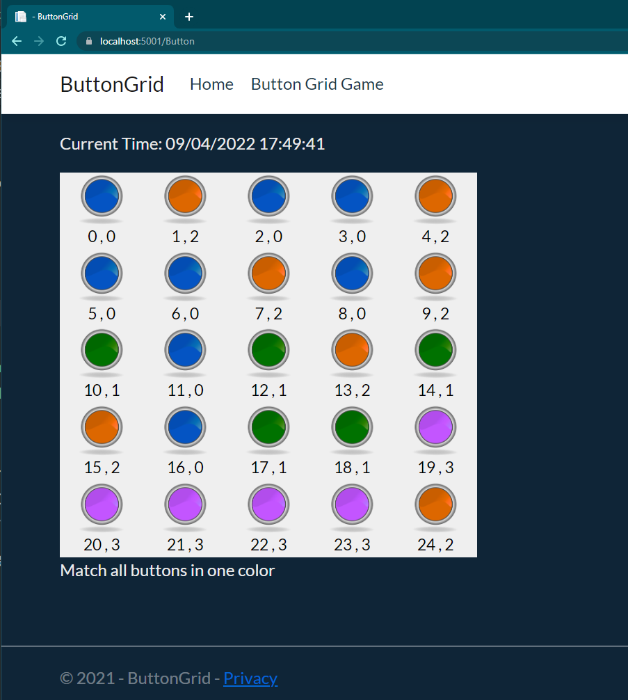

# ASP .NET CORE Button Grid Game with Ajax and JS 
Simple web application which does not update the entire page when you play a game.
## Rules
You have a 5x5 grid. You must match all buttons in one color.

## Game look

# App run:
There are two ways to launch an app:
<li> Launch in Visual Studio
<li>Install .Net Core 5.0 or higher release and then in application folder in terminal and type

>dotnet run

in terminal you will get an url to access your application