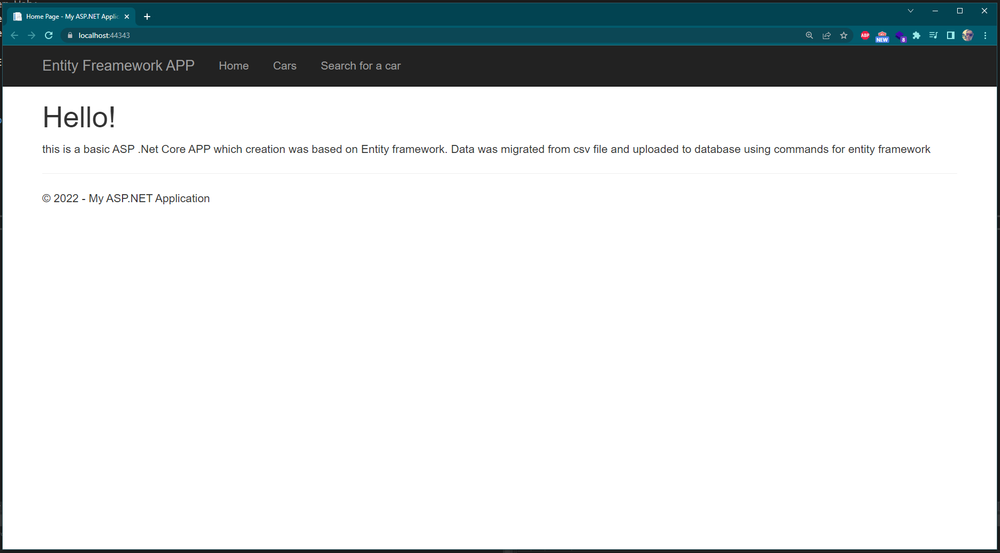
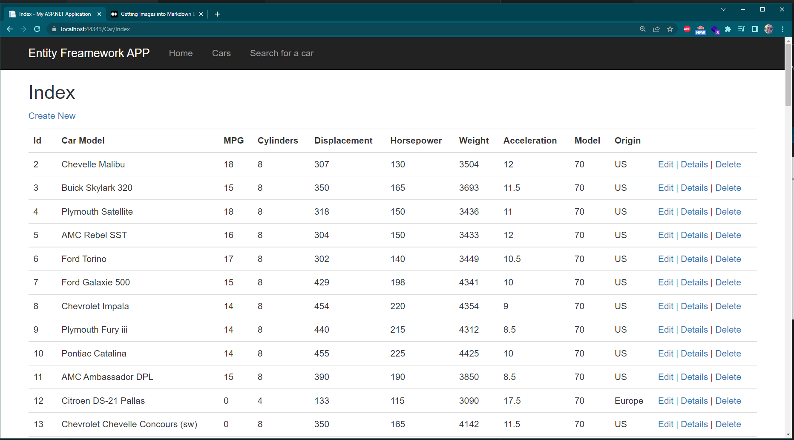
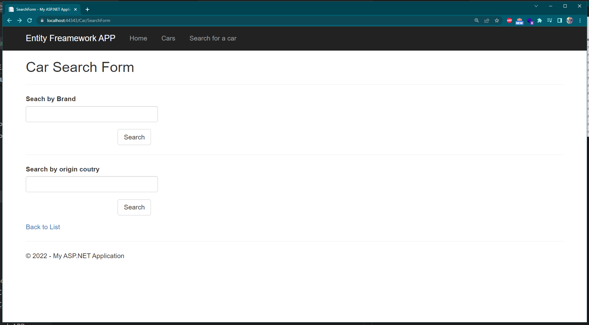

# ASP .Net Framework APP
Simple CRUD web application with database in SQL server.
Application has a standard look with bootstrap frontend.
## welcome screen

## Car list
Data are stored to SQL server database

## Search form
Query is searching data from database.

# App Launching:
<li> Execute in visual studio
